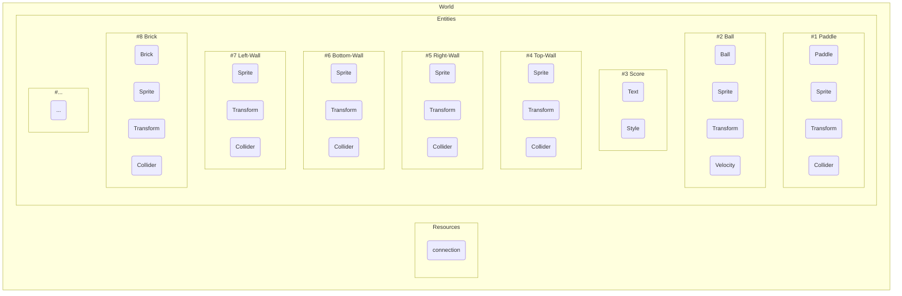
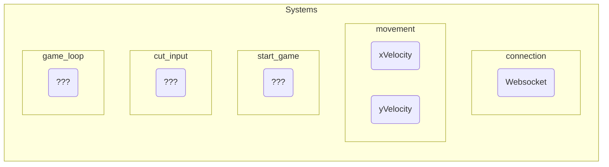
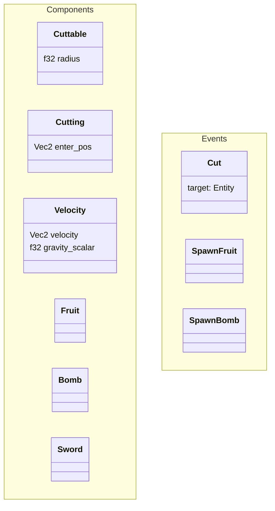

```mermaid
  flowchart LR

  subgraph World
    direction LR

    subgraph Resources
      direction TB
      r0(connection)

    end

    subgraph Entities
      direction TB
      subgraph #1 Paddle
        direction LR
        c1_0(Paddle)
        c1_1(Sprite)
        c1_2(Transform)
        c1_3(Collider)
      end
      subgraph #2 Ball
        direction LR
        c2_0(Ball)
        c2_1(Sprite)
        c2_2(Transform)
        c2_3(Velocity)
      end
      subgraph #3 Score
        direction LR
        c3_0(Text)
        c3_1(Style)
      end

      subgraph #4 Top-Wall
        direction LR
        c4_0(Sprite)
        c4_1(Transform)
        c4_2(Collider)
      end

      subgraph #5 Right-Wall
        direction LR
        c5_0(Sprite)
        c5_1(Transform)
        c5_2(Collider)
      end

      subgraph #6 Bottom-Wall
        direction LR
        c6_0(Sprite)
        c6_1(Transform)
        c6_2(Collider)
      end

      subgraph #7 Left-Wall
        direction LR
        c7_0(Sprite)
        c7_1(Transform)
        c7_2(Collider)
      end

      subgraph #8 Brick
        direction LR
        c8_0(Brick)
        c8_1(Sprite)
        c8_2(Transform)
        c8_3(Collider)
      end

      subgraph #...
        direction LR
        c9_0(...)
      end


    end
  end
```

```mermaid
flowchart LR

subgraph Systems
    subgraph connection
      direction LR
      s1_0(Websocket)
    end

    subgraph movement
      direction LR
      s2_0(xVelocity)
      s2_1(yVelocity)
    end

    subgraph start_game
      direction LR
      s3_0(???)
    end

    subgraph cut_input
        direction LR
        s4_0(???)
    end

    subgraph game_loop
    direction LR
        s5_0(???)
    end

  end
```

```mermaid
classDiagram

namespace Components {

    class Cuttable{
        f32 radius
    }
    class Cutting {
      Vec2 enter_pos
    }
    class Velocity {
      Vec2 velocity
      f32 gravity_scalar
    }

    class Fruit
    class Bomb
    class Sword

}


namespace Events {

  class Cut {
    target: Entity
  }

  class SpawnFruit

  class SpawnBomb

}
```