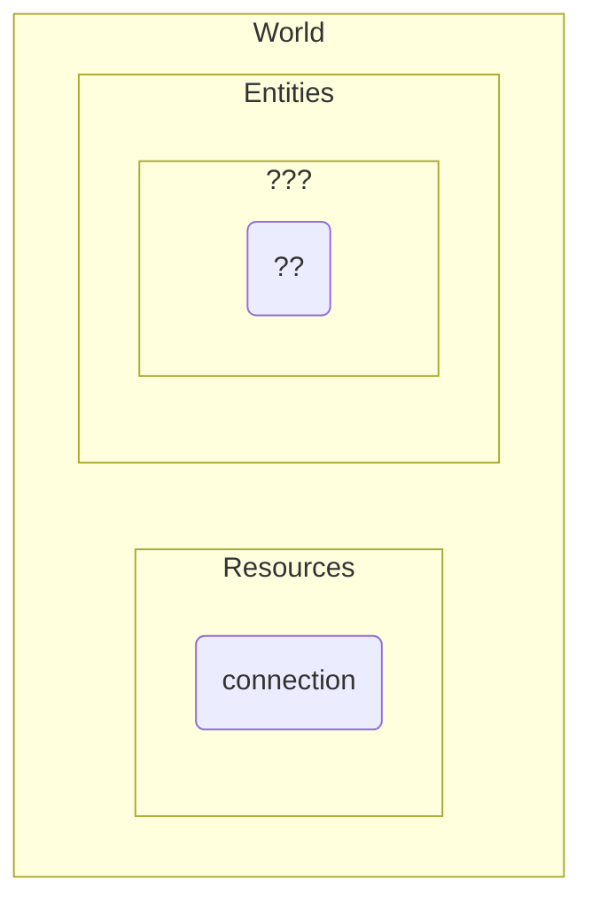
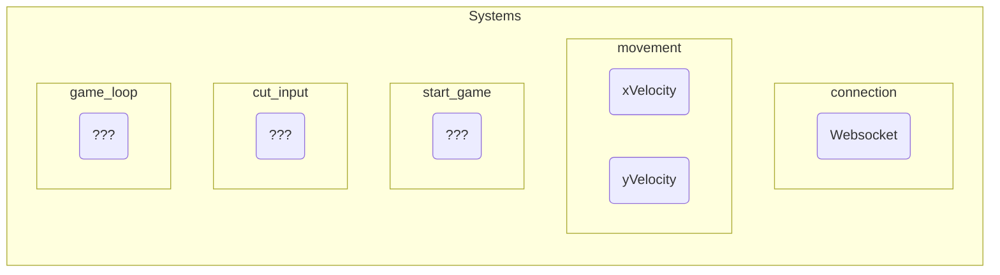
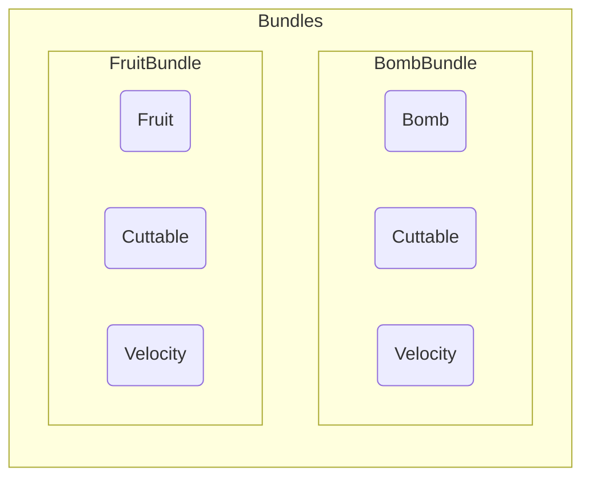
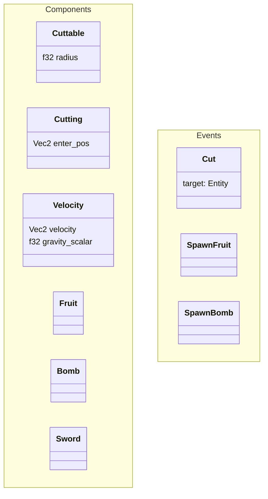

```mermaid
  flowchart LR

  subgraph World
    direction LR

    subgraph Resources
      direction TB
      r0(connection)

    end

    subgraph Entities
      direction TB
      subgraph ???
        direction LR
        c1_0(??)

      end
    end
  end
```

```mermaid
flowchart LR

subgraph Systems
    subgraph connection
      direction LR
      s1_0(Websocket)
    end

    subgraph movement
      direction LR
      s2_0(xVelocity)
      s2_1(yVelocity)
    end

    subgraph start_game
      direction LR
      s3_0(???)
    end

    subgraph cut_input
        direction LR
        s4_0(???)
    end

    subgraph game_loop
    direction LR
        s5_0(???)
    end

  end
```

```mermaid
flowchart LR

subgraph Bundles
    subgraph BombBundle
      direction LR
      b1_0(Bomb)
      b1_1(Cuttable)
      b1_2(Velocity)
    end
    subgraph FruitBundle
      direction LR
      b2_0(Fruit)
      b2_1(Cuttable)
      b2_2(Velocity)
    end
  end
```

```mermaid
classDiagram

namespace Components {

    class Cuttable{
        f32 radius
    }
    class Cutting {
      Vec2 enter_pos
    }
    class Velocity {
      Vec2 velocity
      f32 gravity_scalar
    }

    class Fruit
    class Bomb
    class Sword

}


namespace Events {

  class Cut {
    target: Entity
  }

  class SpawnFruit

  class SpawnBomb

}
```